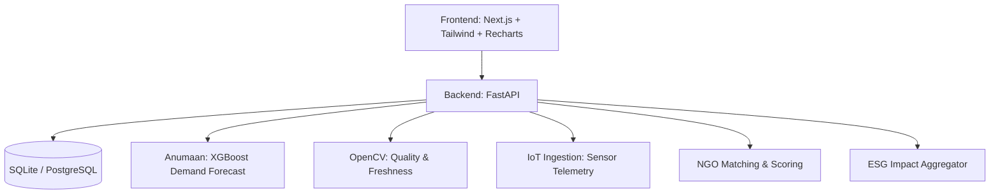

# RasoiIQ — Predict. Rescue. Redistribute.

**Problem Statement:** SIH26234 — AI-powered food waste reduction and surplus redistribution platform for institutional kitchens and food processing units.

## Solution Overview
RasoiIQ is a comprehensive end-to-end platform designed to minimize institutional food waste. By integrating predictive demand modeling (Anumaan), computer vision for food quality checks, real-time IoT processing unit monitoring, and an automated NGO matching and routing engine, RasoiIQ ensures that surplus food is quickly verified, securely rescued, and efficiently redistributed to those in need. 

## Key Features
- **Food Quality Check (Computer Vision):** Uses OpenCV to rapidly assess food freshness via color variance and dark-spot detection, automatically escalating urgency for near-spoilage items.
- **ESG & Sustainability Analytics:** Real-time dashboards calculating kilograms of food saved, equivalent meals donated, CO2e emissions avoided, and financial savings. Includes one-click PDF reporting.
- **Processing Unit Monitor (Simulated IoT):** An active ingestion API (`/iot/ingest`) tracks live telemetry (temperature, humidity, downtime, energy) and triggers rule-based alerts to prevent spoilage at the source.
- **Anumaan AI Forecasts:** XGBoost-powered demand forecasting using historical consumption, climatology, and local events to optimize initial production and prevent overcooking.
- **Intelligent NGO Matching & Routing:** Automatically ranks nearby verified NGOs based on real-time distance and capacity, generating optimized delivery waypoints.

## Architecture Diagram


## Tech Stack
- **Backend:** Python, FastAPI, SQLAlchemy, Pydantic
- **AI/ML & CV:** XGBoost, Scikit-Learn, OpenCV, Pandas, NumPy
- **Frontend:** Next.js 14, React, Tailwind CSS, Recharts, MapLibre GL
- **Database:** SQLite (Default for demo) / PostgreSQL

## Windows Setup Steps

1. **Backend Setup**
   ```powershell
   cd backend
   python -m venv venv
   .\venv\Scripts\activate
   pip install -r requirements.txt
   
   # Generate synthetic data & initialize DB
   python -m scripts.seed_data
   
   # Start the API server
   uvicorn app.main:app --host 0.0.0.0 --port 8080 --reload
   ```

2. **Frontend Setup**
   Open a new terminal window:
   ```powershell
   cd frontend
   npm install
   npm run dev
   ```
   Navigate to `http://localhost:3000` in your browser.

## Demo Credentials
*Note: The platform is currently configured in a demonstration mode without strict multi-role authentication enabled. You will automatically land on the SysAdmin dashboard.*

## Screenshots
*(Insert screenshots of the Dashboard, Quality Check, ESG Report, and IoT Monitor here)*

---

## Acknowledgements
Built on the open-source project by Garv1105 (https://github.com/Garv1105/AI-Powered-Food-Reduction-and-Surplus-Distribution-Management). Original LICENSE retained.
